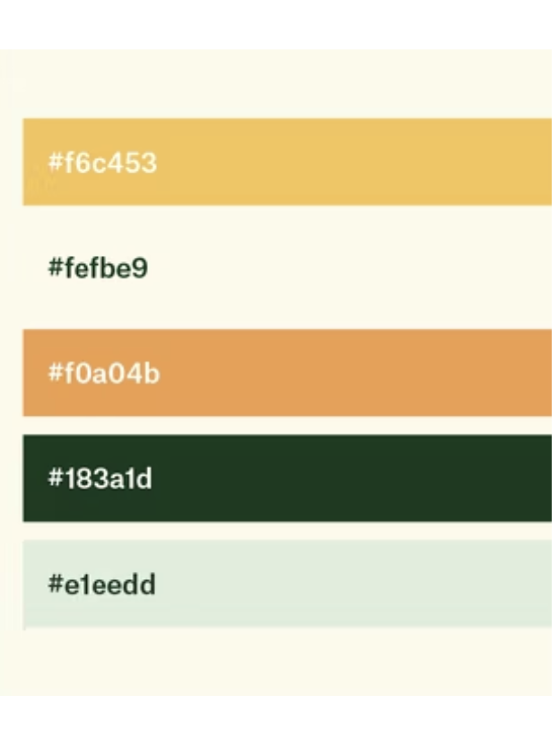

# 

___
# Merchant Hotel

[VIEW THE LIVE PROJECT HERE](/)

---
## INTRO
---
 This is a site for Northen Ireland based luxuary hotel in Belfast that is looking for an online presence. The Merchant Hotel site will give the visitors and users an overview of the services that are offered at this hotel with a strong reliance of captivating images and videos. 

--- 
## BRIEF SITE DEMO OF THE MERCHANT HOTEL

---
## TYPICAL CUSTOMERS

* A family or anyone that is looking for a getway like no other in the city of Belfast.
* Corporate users- overnight stay for a business meeting.
* Couple celebrating an anniversary/milestone in their relationship.
* Corporate customers overnight stay for a business meeting

---
## USER STORIES
* As a first-time visitor I want to see what type of rooms are available so I can request a booking
* As a user I want to see if there are bars or restaurants open to the public so I can book a table
* As a user I want to find contact details so I can call or request a call back
* As a corporate user I want to know if hotel has conference facilities so I can request more information
* As an event organiser I want to know if hotel caters for social events like weddings or birthdays etc

---

## DESIGN PHILOSOPHY
Overall design philosophy is influence mainly by the user and client stories and by the fact that
the hotel is aimed at the high-end market, ideally customers are more influenced by the uniqueness of the experience rather than the cost. 
Hence the choice of colour scheme, layout, and typography.

---
## COLOUR SCHEME AND TYPOGRAPHY
# Font style 
- Rajdhani Will be used throw out the site.
# COLOUR SCHEME

